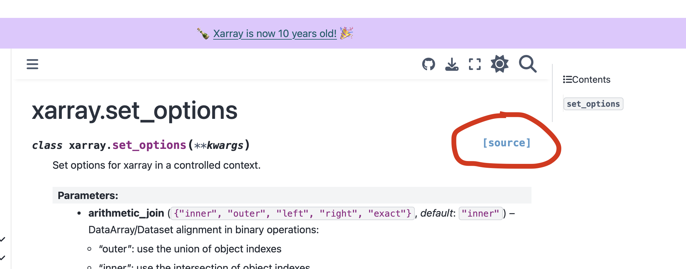

# DevelopingSituations0.01: Implementing module-wide settings in a python package
In python modules, you can often change the behavior of individual functions using optional parameters. You might want to change the width of a line to be plotted using `matplotlib` (`...,linewidth=2,...`) or set a colormap for a plot made through `xarray` (`...,cmap='RdBu',...`). This works fine most of the time, but what if you want every line in a whole script worth of plots to have the same non-default linewidth? Or, more fundamentally, what if you want to, say, change the number of rows that are displayed when `print`ing a `pandas` dataframe to standard out? 

Many packages have a solution for this in the form of module-wide settings or parameters. `Matplotlib` uses [`rcParams`](https://matplotlib.org/stable/users/explain/customizing.html), `xarray` uses [`xr.set_options()`](https://docs.xarray.dev/en/stable/generated/xarray.set_options.html), `pandas` uses [`pd.set_options()`](https://pandas.pydata.org/docs/user_guide/options.html) and so forth. 

Implementing a similar setup for your own package can be tricky. I recently wanted to allow users of `xagg` to set a few module-wide options (whether to post status updates to standard out and what backend algorithm to use), to avoid the annoyance of having to, for example, include `(...,silent=True)` in each call to an `xagg` function. I searched long and hard for a good guide on how to do this, but as often happens with questions relating to intricacies of python package creation and publishing, I have yet to find one (please let me know if you do and I'll link it here!).

So, I turned to the next-best thing. One of the beauties of open-source software is that you can (and should) look at your favorite packages' guts to see how and why they work. This is often easier said than done, since the syntax and 'dialect' used under the hood in python packages often differs markedly from how python is used in everyday coding and data analysis. 

I thought I'd document this journey here, as a kind of double-lesson (for future me, if nothing else): 
1) How to read existing code to learn how to do something
2) How to implement module-wide settings in a python package (to skip to that, click [here]()) 

## Learning from a model module
As a climate researcher, I use `xarray` pretty much every day that I'm coding. I'm very familiar with it as a user, and I'm starting to (little by little) get familiar with how it works under the hood (I even managed to contribute some words recently, but they were mainly documentation fixes to clarify a point that I clearly had not understood around variable storage). I also liked the syntax of `xarray`'s options setting, through a simple `xr.set_options(...)` call. 

So, a natural place to go to learn how to implement a similar setup in `xagg` is to look under the hood at `xr.set_options()`. 

One of the nice things about the `xarray` docs (and that of many other high-quality packages) is that links to the underlying code are available throughout the [API Reference](https://docs.xarray.dev/en/stable/api.html) section of the docs. Clicking on "`[source]`" [`xr.set_options()` API Reference](https://docs.xarray.dev/en/stable/generated/xarray.set_options.html) gets you to the GitHub repo with the code for `xr.set_options()`:


## Creating a module-wide settings function
The reason we can set module-wide options is because variables that are declared in a module (not inside a function) are _global to that modue_. So, for example, in the following file: 

```
# File module/scripts1.py
var1 = 5

def foo(b):
	var2 = b
	return var2
```

we can extract `var1` _but not `var2`_ through an import: 
```
from .scripts1 import var1
print(var1)
```

This variable  


### Additional features
I wanted users of `xagg` to be able to use a `with` block to temporarily set an options parameters, for example:
```
with xa.set_options(silent=True):
	wm = xa.pixel_overlaps(ds,gdf)
	agg = xa.aggregate(ds,wm)
```

To do so (with great thanks to [this](https://stackoverflow.com/questions/1984325/explaining-pythons-enter-and-exit) StackOverflow post), I have to add an `__enter__` and `__exit__` block to the `set_options()` class. The `__exit__` block here is the most important, since it resets the options back to what they were before the `with` block was triggered. 
```
class set_options: 
	...
	...

	# Enter block can be empty
	def __enter__(self):
		return

	# Resets to the original OPTIONS at the end 
	# of a `with` block
	def __exit__(self, type, value, traceback):
		self._apply_update(self.old)
```

NB: To convince yourself that these blocks are triggered during a `with` block (but not if you just regularly call the class), add `print('enter block triggered')` and `print('exit block triggered')` within the `__enter__` and `__exit__` blocks, and run the class inside or outside of a `with` block. You should see the extra lines in standard out only if running it in a `with` block.
